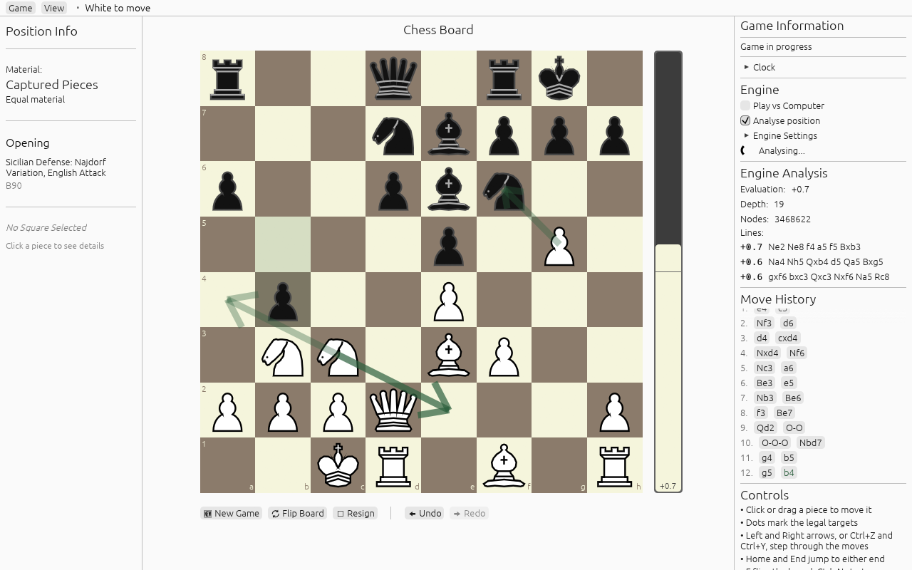

# rust-chess-engine

Desktop chess GUI and terminal CLI in Rust. Plays against a locally installed
[Stockfish](https://stockfishchess.org/) over UCI. Move generation and
validation come from the `chess` crate. The project contains no search engine
of its own.



## Prerequisites

- Rust 1.88 or newer (`rustup update stable`).
- Stockfish on `PATH` for the computer opponent. Arch: `pacman -S stockfish`.
  Debian and Ubuntu: `apt install stockfish`. macOS: `brew install stockfish`.
  Windows: download from stockfishchess.org and put `stockfish.exe` on `PATH`.
- Linux build dependencies for eframe (Debian names):
  `libxcb-render0-dev libxcb-shape0-dev libxcb-xfixes0-dev libxkbcommon-dev libssl-dev`.

## Build and run

```bash
cargo run --release --bin chess-gui
```

```bash
cargo run --bin chess-cli
```

```bash
cargo test --workspace
```

```bash
cargo run -p chess-engine --example test_stockfish
```

The last one only checks that Stockfish answers over UCI.

## Features

- Click or drag to move. Legal targets are marked, the last move is highlighted.
  A pawn reaching the last rank asks which piece it becomes.
- Undo, redo, and click any move in the history to jump to it. Against the
  computer, undo takes back your move and its reply together. Arrow keys,
  Home, End and F work too.
- Checkmate, stalemate, threefold repetition, the fifty-move rule,
  insufficient material, a flag fall or resigning end the game.
- Optional clock with minutes and increment; the engine then manages its own
  time, and a takeback gives the time back.
- Copy the FEN or the PGN, set up a position from a FEN, load a PGN, or save
  the game and open a saved one, under Game. Saved games are PGN files under
  `$XDG_DATA_HOME/rust-chess-engine/games/`.
- "Analyse position" evaluates the position on screen and draws up to five
  engine lines as arrows, the best one boldest, in a game or while browsing
  the history.
- Three themes under View > Theme. Settings, engine threads and hash, and the
  time control are remembered between runs.
- CLI: `e2e4` or SAN (`Nf3`, `O-O`), `play` to face Stockfish, `fen` to print
  or set a position, `undo`.
- Play Stockfish as White or Black, with a depth or time limit and skill level 0 to 20.
  The engine gets the full move list, so it sees repetitions and the 50-move rule.
- Evaluation bar, depth, node count and principal variation while the engine thinks.
- Captured pieces in Lichess or Chess.com style, and the opening's name and
  ECO code from the Lichess opening table.

## Known limitations

- The engine is `CHESS_STOCKFISH` if set, else `stockfish` on `PATH` or in the
  usual places.
- Saved game names and the PGN Date tag use UTC.

The full list and the plan to fix them is in `docs/AUDIT_2026-09-09.md`;
what has been done since is in `CHANGELOG.md`.

## Layout

- `crates/chess-core`: domain types, `GameHistory` with undo, redo and SAN, long-algebraic notation.
- `crates/chess-engine`: async UCI client for the Stockfish process.
- `crates/chess-desktop`: the egui GUI (`chess-gui`) and the CLI (`chess-cli`).
  `app/engine_link.rs` is the engine thread; the UI talks to it with tagged requests.

How the pieces fit together is in `docs/ARCHITECTURE.md`.

The test that drives a real Stockfish is ignored by default:

```bash
cargo test -p chess-desktop -- --ignored
```

## Licence

MIT. See `LICENSE`.

The opening names in `crates/chess-core/data/openings.tsv` are the Lichess
opening table, released by Lichess under CC0 1.0; see the README next to it.
